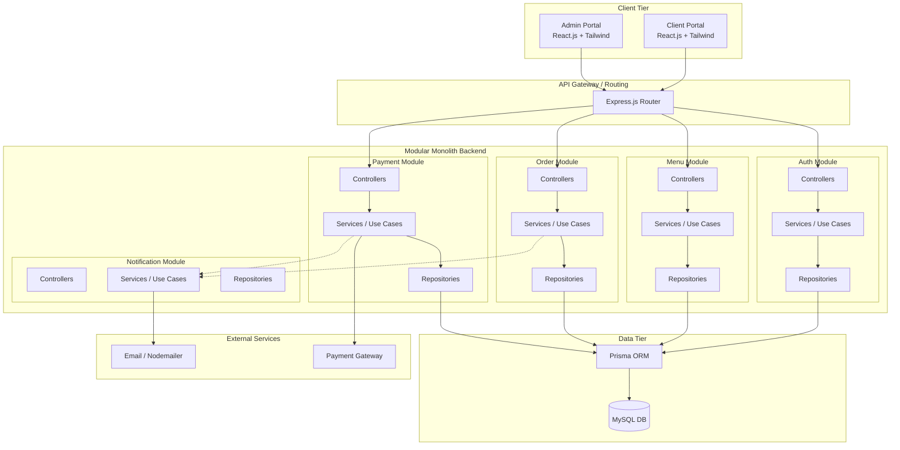
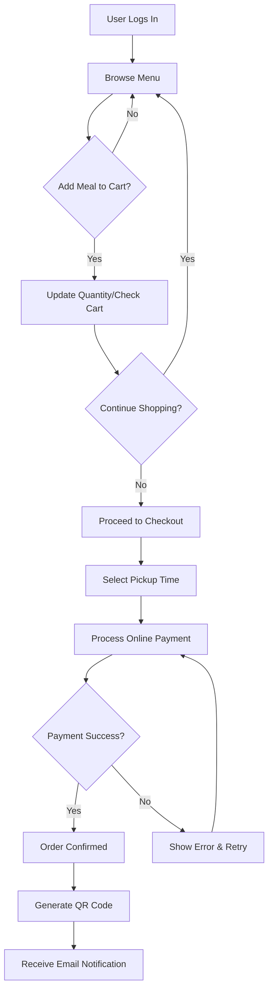
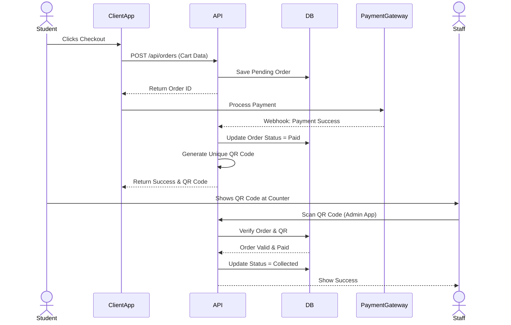
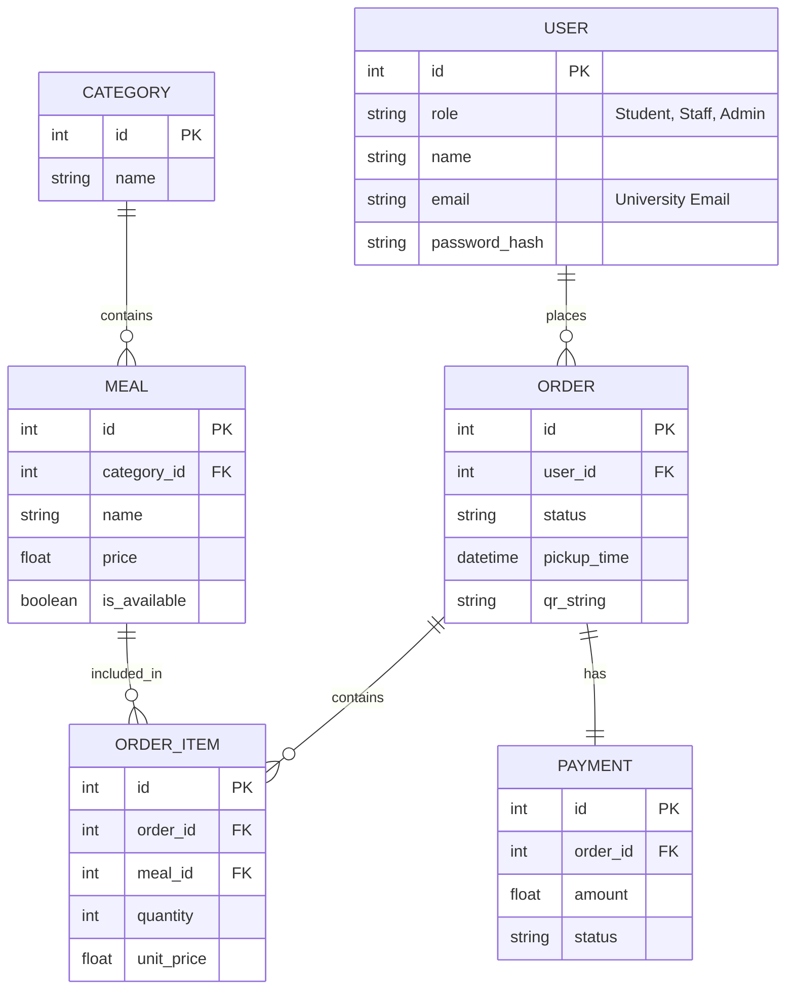
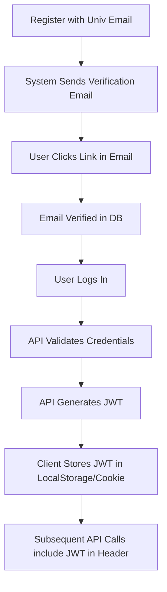

# Campus Canteen Web Portal - System Architecture & Design

> [!NOTE]
> This document outlines the architectural design and system specifications for the Campus Canteen Web Portal, following Clean Architecture and Modular Monolith principles.

## 1. System Architecture

The system will use a Modular Monolith backend architecture to ensure maintainability and high cohesion without the operational complexity of microservices.



## 2. Folder Structures

### Backend (Node.js + Clean Architecture)
```text
backend/
├── prisma/                 # Prisma schema and migrations
├── src/
│   ├── config/             # Environment, DB, and external service configs
│   ├── shared/             # Shared utilities, errors, middlewares
│   ├── modules/            # Modular Monolith boundaries
│   │   ├── auth/
│   │   │   ├── controllers/
│   │   │   ├── services/
│   │   │   ├── repositories/
│   │   │   ├── routes.js
│   │   ├── users/          # (Same internal structure)
│   │   ├── menu/
│   │   ├── orders/
│   │   ├── payments/
│   │   └── notifications/
│   ├── app.js              # Express app setup
│   └── server.js           # Entry point
└── package.json
```

### Frontend (React.js - Client & Admin Portals)
```text
frontend-client/ (and similarly frontend-admin/)
├── public/
├── src/
│   ├── assets/             # Images, fonts
│   ├── components/         # Shared UI components (Tailwind based)
│   ├── context/            # React Contexts (Auth, Cart, etc.)
│   ├── hooks/              # Custom React hooks
│   ├── layouts/            # Page layouts (Navbar, Sidebar, Footer)
│   ├── pages/              # Route components
│   ├── services/           # Axios API clients
│   ├── utils/              # Helper functions
│   ├── App.jsx             # Router definition
│   └── main.jsx            # Entry point
└── tailwind.config.js
```

## 3. Database Entities

1. **User**: ID, Role, Name, UniversityEmail, PasswordHash, IsVerified, CreatedAt.
2. **Category**: ID, Name, Description, IsActive.
3. **Meal**: ID, CategoryID, Name, Description, Price, IsAvailable, ImageURL.
4. **Order**: ID, UserID, TotalAmount, Status (Pending, Paid, Preparing, Ready, Collected, Cancelled), PickupTime, QRString, CreatedAt.
5. **OrderItem**: ID, OrderID, MealID, Quantity, UnitPrice.
6. **Payment**: ID, OrderID, Amount, Status (Success, Failed), TransactionID, Timestamp.

## 4. Module Boundaries

- **Auth Module**: Registration, login, email verification, JWT generation.
- **User Module**: Profile management, student/staff data.
- **Menu Module**: Categories, meals, availability, and pricing.
- **Order Module**: Cart management (if server-side), checkout, order status, QR code generation.
- **Payment Module**: Processing dummy/real online payments, generating receipts.
- **Notification Module**: Nodemailer integration, sending emails for order states.

## 5. API List

| Module | Method | Endpoint | Description | Auth Req |
| :--- | :--- | :--- | :--- | :--- |
| **Auth** | POST | `/api/auth/register` | Register new user | No |
| | POST | `/api/auth/login` | Login user | No |
| | GET | `/api/auth/verify-email` | Verify university email | No |
| **Users** | GET | `/api/users/me` | Get current user profile | Yes |
| **Menu** | GET | `/api/menu/categories` | List categories | No |
| | GET | `/api/menu/meals` | List meals (filterable) | No |
| | POST | `/api/admin/menu/meals` | Add a meal | Admin |
| | PUT | `/api/admin/menu/meals/:id`| Update meal availability | Admin |
| **Orders**| POST | `/api/orders` | Create an order | Yes |
| | GET | `/api/orders/:id` | Get order details | Yes |
| | GET | `/api/orders/history` | User's order history | Yes |
| | PUT | `/api/admin/orders/:id` | Update order status | Admin |
| **Pay** | POST | `/api/payments/checkout` | Initiate payment | Yes |
| | POST | `/api/payments/webhook` | Payment confirmation | No |

## 6. User Flows (Student Ordering a Meal)



## 7. Sequence Diagrams (Checkout & Collection)



## 8. ER Diagram



## 9. Authentication Flow



## 10. Recommended Development Phases

### Phase 1: Foundation & Backend Core (Weeks 1-2)
- Set up monorepo or separate repos (Backend, Frontend-Client, Frontend-Admin).
- Initialize Node.js, Express, Prisma, MySQL.
- Implement Authentication module (JWT, Email Verification).
- Implement basic Menu and Categories API.

### Phase 2: Frontend Client Foundation & Menu (Weeks 3-4)
- Initialize React + Tailwind for Client App.
- Set up routing, Auth Context, and API service layer.
- Build Login/Register screens.
- Build Menu browsing UI (Categories, Items, Availability).

### Phase 3: Orders & Shopping Cart (Weeks 5-6)
- Implement Cart state management (React Context/Zustand).
- Build Checkout API & UI (Pickup times, Order Summary).
- Implement Payment mock integration and status updates.
- Generate and display QR Codes.

### Phase 4: Admin Portal (Weeks 7-8)
- Initialize React for Admin App.
- Implement Menu Management (Add, Edit, toggle out-of-stock).
- Implement Order Management Dashboard (Real-time or polling).
- Implement QR Scanner functionality for order collection.

### Phase 5: Notifications, Polish & Deployment (Weeks 9-10)
- Integrate Nodemailer for email alerts.
- Final UI/UX polish (micro-animations, modern UI components).
- Thorough testing (Roles, access control, invalid QR codes).
- Production deployment (e.g., Vercel for Frontend, Render/AWS for Backend).
